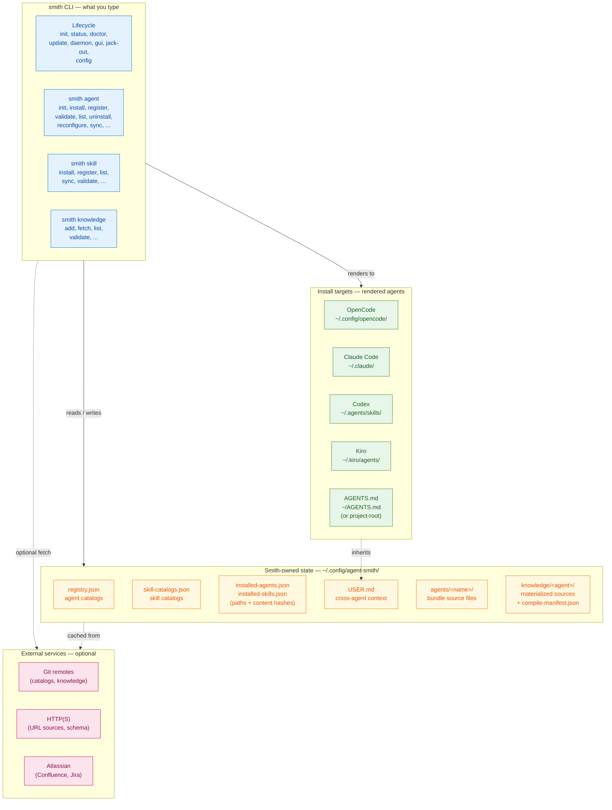
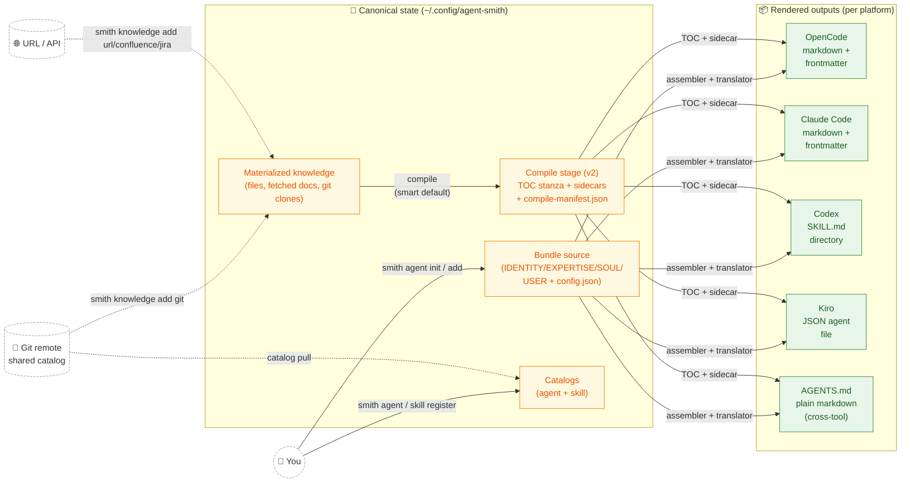
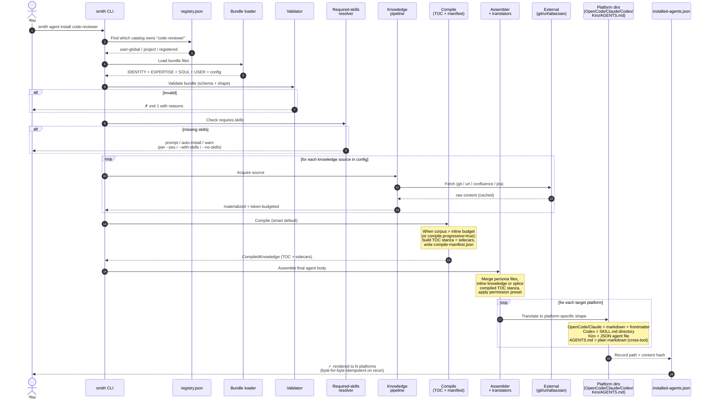
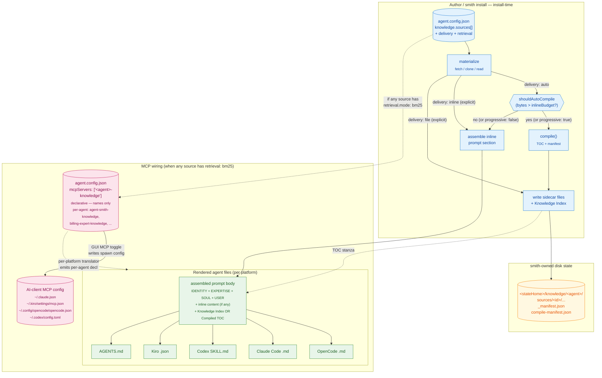
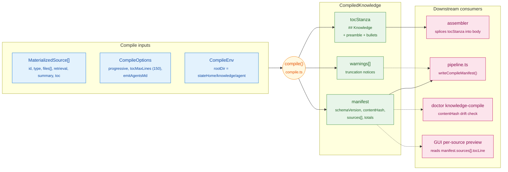

# How agent-smith works — a visual tour

You author one bundle. Smith renders five platform-specific outputs. The diagrams below show where each step lives, what data moves between the parts, and what happens when you run the single most important command in the system.

> **30-second orientation.** Smith's pipeline has a **compile stage** between materialize and translate (progressive-disclosure TOC + sidecars), five install targets (OpenCode / Claude Code / Codex / Kiro / AGENTS.md — the last consumed by Cursor / Windsurf / Aider / Copilot / Codex CLI / Junie / Roo / Zed / Warp / Gemini CLI), and an optional per-agent **BM25 retrieval MCP server** (`smith knowledge serve`). Compile is the smart default (auto-flips when the corpus would overflow the inline budget); a GUI per-source editor and MCP-wiring toggle drive the same machinery via `smith knowledge wire`. Operational depth lives in [`guide/16 — Knowledge compiler`](./guide/16-knowledge-compiler.md); this doc is the system-level overview.

> **30-second mental model**
>
> - **Bundle** = source. Four files: `IDENTITY.md`, `EXPERTISE.md`, `SOUL.md`, `agent.config.json` (plus `USER.md`).
> - **Catalog** = a directory of bundles, registered with smith.
> - **Install** = render a bundle into one or more platforms (OpenCode, Claude Code, Codex, Kiro, AGENTS.md).
>
> Everything else in this doc elaborates on those three nouns.

If you're going to run one command first, run `smith status` — it shows you what state smith owns on your machine, with no side-effects.

---

## Core vocabulary (read this first)

The terms below appear in every diagram. Long-tail terms live in the [full glossary](#full-glossary) at the end.

| Term | What it is |
|---|---|
| **Bundle** | The 4-file source-of-truth for an agent: `IDENTITY.md` + `EXPERTISE.md` + `SOUL.md` + `agent.config.json`, plus a `USER.md` (symlink or stub). |
| **Catalog** | A directory of bundles, registered with smith. Three kinds: `user-global` (your default `~/.config/agent-smith/agents/`), `project` (per-repo), `registered` (typically a shared git remote). |
| **Install target** | A platform smith can render into: **OpenCode**, **Claude Code**, **Codex**, **Kiro**, or **AGENTS.md**. Each target has its own file layout and frontmatter shape; AGENTS.md is the cross-tool plain-markdown convention read by Cursor / Windsurf / Aider / Copilot / Codex CLI / Junie / Roo / Zed / Warp / Gemini CLI. |
| **Knowledge source** | External content (file, URL, git repo, Confluence page, Jira issue) attached to an agent in `agent.config.json`. Fetched once, cached, then inlined, written as a sidecar, or rolled into a compiled TOC at install time. |
| **Compile stage** | The pipeline step between materialize and translate. Turns the materialized knowledge cache into a TOC stanza (≤150 lines) + sidecars + `compile-manifest.json`. Smart default: flips on automatically when the corpus would overflow the inline budget. See [`guide/16`](./guide/16-knowledge-compiler.md). |
| **Retrieval server** | Optional per-agent stdio MCP server (`smith knowledge serve <agent> --stdio`) that exposes `knowledge.search` (BM25) and `knowledge.fetch` over the materialized cache. Off by default; opted into via the bundle's `mcpServers` block. Advertises `serverInfo.name = "<agent>-knowledge"` so multiple bundles coexist in one client. |
| **Translator** | The platform-specific code that converts the canonical assembled agent into the right shape for one target. One translator per platform (5 total), in `src/core/translators/`. |
| **USER.md** | Your shared cross-agent context. Symlinked into personal bundles so every agent on your machine inherits it; stubbed in shared catalogs so the bundle is safe to commit. |

---

## 1. Component map — what's in the system

The system has four zones: **what you type** (the CLI), **what smith owns** (state on disk), **what gets written** (install targets), and **what smith reaches out to** (external services).



**What this tells you:**
- The CLI has four flavors of command (lifecycle + three namespaces). Each verb either reads/writes state, renders to targets, or both.
- Smith owns one directory (`~/.config/agent-smith/`). Everything else is either user input (commands) or output (rendered files on platforms).
- External calls are dashed because they're optional — you can run the whole system offline once knowledge is cached.
- Each platform has its own file layout: OpenCode and Claude Code use `agents/` + `skills/` directories; Codex installs agents *as* skills (`<name>/SKILL.md`); Kiro consumes a single JSON file per agent; AGENTS.md is a single plain-markdown file at the project or home root that Cursor / Windsurf / Aider / Copilot / Codex CLI / Junie / Roo / Zed / Warp / Gemini CLI all read.
- The five targets are reached from one bundle: `targets: ["opencode", "claude-code", "codex", "kiro", "agents-md"]`. When AGENTS.md is on the list and `claude-code` is too, the claude-code translator emits a 1-line CLAUDE.md pointer instead of a duplicate body.
- `knowledge/<agent>/` holds the materialized cache plus (for compiled bundles) `compile-manifest.json` — the v2 record of what TOC line each source produced and the hash that drives drift detection.

> **Want detail?** [`guide/13-paths-and-state.md`](./guide/13-paths-and-state.md) — every path smith reads or writes. [`guide/03-installing-and-rendering.md`](./guide/03-installing-and-rendering.md) — what each translator emits.

---

## 2. Data-flow — what moves through the system

Smith is a **content-translation pipeline**: author bundles in one canonical shape; render to five platform-specific shapes.



**What this tells you:**
- You write **one** bundle. Smith renders **five** outputs (one per supported platform: OpenCode, Claude Code, Codex, Kiro, and AGENTS.md).
- Knowledge sources come from anywhere (local files, the web, Confluence, Jira, git repos) — they get *materialized* into smith's state directory first. The **compile stage** (smart default) then turns the cache into a TOC stanza + sidecars; small corpora skip compile and stay inline.
- The same compiled output feeds every translator — translators don't know whether they're consuming a v1 inline body or a v2 TOC.
- Shared agent catalogs are versioned in git. Smith pulls them just like any other source.

> **Want detail?** [`guide/02-bundle-anatomy.md`](./guide/02-bundle-anatomy.md) — the bundle file format. [`guide/04-knowledge.md`](./guide/04-knowledge.md) — knowledge sources end-to-end. [`guide/06-permissions-and-platforms.md`](./guide/06-permissions-and-platforms.md) — translator differences.

---

## 3. Install lifecycle — `smith agent install <name>`

The single most important command in the system. Understanding what happens when you run it explains 80% of the codebase.



### Concrete trace: `smith agent install code-reviewer` with all five targets

`targets: [opencode, claude-code, codex, kiro, agents-md]`

```
1. Reg lookup       →  ~/.config/agent-smith/agents/code-reviewer/  (user-global)
2. Bundle load      →  IDENTITY.md, EXPERTISE.md, SOUL.md, USER.md (symlink), agent.config.json
3. Validate         →  ✓ schema OK, action-phrase description OK, all 5 targets supported
4. Required skills  →  declares the-architect → already installed, skip
5. Knowledge fetch  →  no sources declared, skip
6. Compile          →  no sources → no TOC stanza; skip (smart-default falls through)
7. Assemble         →  merged body (persona + USER.md + permission preset "read-edit")
8. Translate        →  OpenCode:    ~/.config/opencode/agents/code-reviewer.md
                       Claude Code: ~/.claude/agents/code-reviewer.md   (1-line "See AGENTS.md.")
                       Codex:       ~/.agents/skills/code-reviewer/SKILL.md
                       Kiro:        ~/.kiro/agents/code-reviewer.json
                       AGENTS.md:   ~/AGENTS.md
9. Manifest         →  installed-agents.json: 5 entries, each {path, sha256}
10. Result          →  ✓ installed to 5 platforms
```

When the bundle declares knowledge sources large enough to overflow the inline budget, step 6 produces a TOC stanza + sidecars + `compile-manifest.json`; the assembler splices the TOC into the body and the sidecars are written next to (or symlinked into) each target's per-agent knowledge dir.

**What this tells you:**
- Install is a **pipeline**: lookup → load → validate → resolve deps → fetch knowledge → assemble → translate → write manifest. Each stage has clear inputs and outputs.
- Knowledge fetching is the slow part. Everything else is local file I/O.
- The same pipeline runs for one agent (`install`) or all of them (`install-all`).
- The **manifest write** at the end is what makes uninstall safe: smith only deletes files it recorded, and refuses if the on-disk hash doesn't match (you or another tool edited it).

> **Want detail?** [`guide/03-installing-and-rendering.md`](./guide/03-installing-and-rendering.md) — manifest semantics, idempotency, `--force` rules. [`guide/12-error-handling.md`](./guide/12-error-handling.md) — every exit code and `SmithError` variant on this path.

---

## 4. Full glossary

Every term that appears in this document, alphabetized. The first six are summarized at the top under [Core vocabulary](#core-vocabulary-read-this-first); the rest live here.

| Term | What it is | Where it lives |
|---|---|---|
| **Agent** | A persistent AI assistant persona with its own identity, expertise, and knowledge. The thing you actually use day-to-day in OpenCode / Claude Code / Codex / Kiro / any AGENTS.md-aware tool. | Authored in a *bundle*; rendered to platform dirs. |
| **agent.config.json** | Per-bundle config: description, targets, model tier, permission preset, knowledge sources, required skills, optional `compile` block, `mcpServers` declarations. | Inside each bundle. |
| **agents-md** | The fifth install target. Translator emits a single plain-markdown `AGENTS.md` consumed by Cursor / Windsurf / Aider / Copilot / Codex CLI / Junie / Roo / Zed / Warp / Gemini CLI. Default install root is `$HOME` (override via `targetOptions.agentsMd.path`). When both `claude-code` and `agents-md` target a project root, the claude-code translator emits a 1-line CLAUDE.md pointer. | `src/core/translators/agents-md.ts`; output at `~/AGENTS.md` or a configured path. |
| **APM import** | One-way importer (`smith agent init --from-apm <path-or-url>`) that turns a Microsoft `apm.yml` into a smith bundle. APM runtimes map onto smith targets (copilot/cursor/gemini/windsurf collapse to `agents-md`); APM `references[]` become smith knowledge sources. | `src/core/apm-import.ts` |
| **Assembler** | The function that merges IDENTITY + EXPERTISE + SOUL + USER + knowledge (inline body or compiled TOC stanza) into the final agent body before translation. | `src/core/assembler.ts` |
| **BM25 index** | Lexical-only (no embeddings) ranking index built in-memory at retrieval-server startup over the agent's materialized knowledge dir. ~200 LOC, ms-scale build, no model dependency. | `src/core/knowledge/bm25.ts` |
| **Bundle** | A folder with the four persona files (IDENTITY/EXPERTISE/SOUL/USER) and `agent.config.json`. The canonical source-of-truth for an agent. | `~/.config/agent-smith/agents/<name>/` (user-global) or any registered catalog. |
| **Catalog** | A directory containing one or more bundles, registered with smith. Agent kinds: `user-global`, `project`, `registered`. Skill kinds: `user-global`, `user-local`, `team-shared`. | Anywhere on disk; tracked in `registry.json` / `skill-catalogs.json`. |
| **Compile stage** | The pipeline step between materialize and translate. Produces a TOC stanza (≤150 lines), sidecars, and `compile-manifest.json`. Smart default: flips on automatically when the materialized corpus would overflow the inline budget; explicit `compile.progressive: true/false` overrides; explicit `delivery: "inline"` on any source pins the bundle to inline-only. Manual entry point: `smith knowledge compile <agent>` (offline — reads already-materialized files). | `src/core/knowledge/compile.ts`; `src/core/knowledge/pipeline.ts` (`shouldAutoCompile`). |
| **compile-manifest.json** | Per-source TOC line, on-disk path, retrieval mode, content hash, byte / token totals — the v2 record of "what compiled to what." Drives idempotency, doctor's `knowledge-compile` drift detection, and the GUI's per-source preview. | `~/.config/agent-smith/knowledge/<agent>/compile-manifest.json` |
| **Daemon** | Optional background watcher. On a 15-minute tick, it `git pull`s every `registered` catalog (agents and skills); on a separate 5-minute tick, it refreshes `ttl`-mode knowledge sources. Writes a heartbeat file to `~/.local/state/agent-smith/daemon.heartbeat.json`. Does **not** pull the agent-smith install itself — that's `smith update`. | `smith daemon start/stop/status` |
| **Doctor** | Health-check command. Verifies platform installs, model resolution, skill drift, registry hygiene, Atlassian credentials, knowledge-refresh hooks, knowledge-prompt-disk-consistency, remote-catalogs, and duplicate-catalogs. | `smith doctor` |
| **EXPERTISE.md** | One of the four persona files. Domain knowledge, methodology, techniques the agent applies. | Inside each bundle. |
| **IDENTITY.md** | One of the four persona files. The agent's role and primary purpose ("you are a code reviewer who…"). | Inside each bundle. |
| **installed-agents.json** | Manifest of every rendered agent file: path + content hash per platform. Drives idempotent reinstall, `would-clobber` refusal, and hash-mismatch refusal on uninstall. | `~/.config/agent-smith/installed-agents.json` |
| **installed-skills.json** | Same manifest pattern, for skills. | `~/.config/agent-smith/installed-skills.json` |
| **Install target** | A platform smith renders agents into: **OpenCode**, **Claude Code**, **Codex**, **Kiro**, or **AGENTS.md** (cross-tool). Each has its own file layout and frontmatter shape. | `~/.config/opencode/agents/`, `~/.claude/agents/`, `~/.agents/skills/<name>/SKILL.md`, `~/.kiro/agents/<name>.json`, `~/AGENTS.md` (or configured path). |
| **Knowledge source** | External content (file, dir, glob, URL, git repo, Confluence space, Jira query) attached to an agent. Fetched once, cached, then either inlined (v1 / explicit `delivery: "inline"`), written as a sidecar (v1 / `delivery: "file"`), or rolled into a compiled TOC + sidecar (v2 compile stage). URL-typed sources may set `via: { server, tool }` to route fetches through an MCP server (resolved by a three-layer cache → `_meta` → curated-registry resolver). | Declared in `agent.config.json`; materialized to `~/.config/agent-smith/knowledge/<agent>/`. |
| **Permission preset** | One of `read-only`, `read-edit`, `full`. Maps to platform-specific permission JSON during translation. Custom rules via `--permission-json`. | Set per bundle; applied by translators. |
| **Platform conventions** | Optional per-platform context smith can inject at install time. Kiro is the first registered case (workspace + global steering files). Bundles opt-in via `platformConventions` in config. | `src/core/platform-conventions.ts`; user-global preference at `~/.config/agent-smith/conventions.json`. |
| **registry.json** | Smith's record of every agent catalog it knows about. | `~/.config/agent-smith/registry.json` |
| **Rendered files** | The platform-specific agent file(s) smith writes into install targets. Re-derivable from the bundle at any time. | Platform agent dirs. |
| **Required skills** | Runtime skill dependencies an agent needs (`requires.skills` in config). Resolved at install time (prompt / auto-install / warn). | Declared in `agent.config.json`. |
| **Retrieval server** | Optional per-agent stdio MCP server (`smith knowledge serve <agent> --stdio`) that exposes `knowledge.search(query, k)` (BM25) and `knowledge.fetch(path, range?)` (range-bounded read) over the materialized cache. Off by default; opted into via the bundle's `mcpServers` block + the AI client's own MCP config. Foreground per-session — MCP stdio handles lifecycle. | `src/core/knowledge/serve-mcp.ts` |
| **Skill** | A standalone capability (Anthropic Agent Skills format) installable across platforms. Independent from agents; agents can require skills, but skills don't require agents. | `skills/<name>/SKILL.md`; installed to platform skill dirs. |
| **skill-catalogs.json** | Smith's record of every skill catalog. Parallel to `registry.json` but for skills. | `~/.config/agent-smith/skill-catalogs.json` |
| **SOUL.md** | One of the four persona files. Tone, voice, values — how the agent communicates. | Inside each bundle. |
| **Status** | Quick summary of where smith's state lives and what's registered. | `smith status` |
| **Translator** | Platform-specific code that converts the canonical assembled agent into OpenCode / Claude Code / Codex / Kiro / AGENTS.md shape. One translator per platform (5 total). | `src/core/translators/` |
| **USER.md** | One of the four persona files — but unlike the others, it's typically a *symlink* to your shared `~/.config/agent-smith/USER.md`. For bundles in personal catalogs (`user-global`, `project`) it's a symlink; for bundles in `registered` catalogs (created with `--catalog`) it's a stub file so the bundle is safe to commit. Every agent automatically inherits your cross-agent context (name, role, preferences). | `~/.config/agent-smith/USER.md` (canonical); symlinked into personal bundles, stubbed in registered ones. |

---

## 5. Knowledge loading — from sources to running tools

Knowledge is the most layered subsystem in agent-smith. Three concerns interleave: **delivery** (how content reaches the agent's prompt — inline, sidecar, or both), **retrieval** (whether a search tool is exposed via MCP), and **per-platform shape** (each AI client wires MCP differently). This section maps all three onto a single picture.

### 5.1 The three loading modes

A knowledge source's `delivery` field on `agent.config.json` chooses one of three modes:

| Mode | When | What lands at install time | What the agent does at runtime |
|---|---|---|---|
| `inline` | Small, always-relevant content (style guide, glossary). Explicit author choice, never auto-selected. | The materialized text is concatenated into the rendered system prompt as a `## Knowledge` section. | Reads it verbatim every turn. No tool calls. Token-cost is paid on every message. |
| `file` | Default for most sources. | The materialized files are written to `<stateHome>/knowledge/<agent>/sources/<id>/...`. The rendered prompt gets a permission grant for that dir plus a `## Knowledge Index` listing the files. | Calls `Read` on a file when the index suggests it's relevant. Token-cost is paid only when the agent reads. |
| `auto` (smart default) | Author leaves `delivery` unset. | At install time, smith totals the materialized bytes. If `total > inlineBudget.totalTokens` (default 8000), routes through the **compile stage**: emits a tight `## Knowledge` TOC stanza + `compile-manifest.json`, sources go to disk like `file` mode. Otherwise routes through `inline` so small bundles stay always-resident. | Same as the chosen leaf mode — TOC + on-demand `Read` for compiled bundles, always-resident text for inlined ones. |

Independently of `delivery`, a source can declare `retrieval.mode: "bm25"` to opt into MCP-tool-based search. This adds a fourth tool-shaped axis on top of the three delivery modes — the agent gets `knowledge.search(query, k)` and `knowledge.fetch(path, range?)` instead of (or in addition to) raw `Read`. The retrieval index is built **at session-start by the AI client**, not at install-time by smith — see §5.3.

### 5.2 The full loading pipeline



**Three things to read off this picture:**

1. **`delivery` is decided at install time, not runtime.** Once the bundle is rendered, the prompt either has the inline text or it has a TOC pointing at sidecar files. The agent has no choice — it does what its prompt directs.
2. **The compile stage is a *transformation* on the materialized output, not a separate fetch.** Materialize runs once; compile re-shapes the result.
3. **MCP wiring is a separate axis from delivery.** A bundle can have `delivery: file` *and* `retrieval.mode: bm25` — the sidecar files are still written, AND the agent gets `knowledge.search` over the same files. They're complementary, not exclusive.

### 5.3 Retrieval-server lifecycle (when MCP is wired)

When the bundle's `mcpServers` declares its per-agent key (`<agent>-knowledge` — e.g. `agent-smith-knowledge` for the `agent-smith` bundle, `billing-expert-knowledge` for a `billing-expert` bundle) AND the user's AI-client MCP config has the spawn entry, every session opens a fresh `smith knowledge serve` subprocess:

```mermaid
sequenceDiagram
    autonumber
    actor User
    participant Client as AI client<br/>(Kiro / Claude Code /<br/>OpenCode / Codex)
    participant Smith as smith knowledge serve<br/><sub>spawned subprocess</sub>
    participant FS as Materialized cache<br/><sub>stateHome/knowledge/agent/</sub>
    participant Agent as The agent's<br/>system prompt

    User->>Client: open agent (e.g. /agents agent-smith)
    Client->>Client: read MCP config (per-platform location)<br/>find &lt;agent&gt;-knowledge entry
    Client->>Smith: spawn: smith knowledge serve [agent] --stdio
    Smith->>FS: walk sources/, build BM25 index<br/>(in-memory — no on-disk cache)
    FS-->>Smith: file list + contents
    Client->>Smith: initialize (MCP handshake)
    Smith-->>Client: capabilities: { tools: { listChanged: false } }
    Client->>Smith: tools/list
    Smith-->>Client: [knowledge.search, knowledge.fetch]
    Note over Client,Agent: At this point the tools appear in the agent's<br/>available toolset. The system prompt's<br/>compiled TOC has a "(searchable: bm25)" hint<br/>so the agent prefers the search tool.
    User->>Agent: question
    Agent->>Smith: tools/call knowledge.search("retry policy", k=5)
    Smith->>FS: BM25 rank over indexed files
    FS-->>Smith: top-k file paths + score + snippet
    Smith-->>Agent: hits
    Agent->>Smith: tools/call knowledge.fetch("sources/runbook/retries.md")
    Smith->>FS: read file (range-bounded — 64KB cap)
    FS-->>Smith: content
    Smith-->>Agent: file body
    Agent-->>User: answer (cites the file path)
    User->>Client: end session
    Client->>Smith: close stdin
    Smith->>Smith: clean exit (process tree teardown)
```

Notes:

- **The server is per-session, not per-machine.** Every new session spawns a fresh subprocess. The BM25 index is rebuilt on every spawn. This is fine because rebuild is millisecond-scale (a few thousand markdown files).
- **The bundle's `mcpServers` is documentation-only — it lists *names*, not spawn configs.** The actual spawn config (`command`, `args`, `env`) lives in the AI client's own MCP config file (`~/.claude.json`, `~/.kiro/settings/mcp.json`, etc.). The GUI's MCP toggle writes both: the bundle's `mcpServers` array AND the spawn entries into each detected AI client's config.
- **smith launcher must be invocable from a stripped-PATH context** (Spotlight, dock, Finder spawns). `bin/install` writes a wrapper at `~/.local/bin/smith` with hardcoded `bun` and entry-script paths so a `#!/usr/bin/env bun` shebang doesn't fail when the spawning client doesn't inherit the user's shell PATH.
- **Per-platform per-agent MCP emission differs.** Kiro requires the agent's rendered JSON to declare `mcpServers: {}` + `includeMcpJson: true` + `tools: ["@<server>"]` + `allowedTools: ["@<server>"]` for the agent to *see* the server in its scoped view. Claude Code accepts `mcpServers: [<names>]` in frontmatter for subset scoping (default: inherit-all). OpenCode default-inherit-all needs nothing. Codex emits a `<name>/agents/openai.yaml` sidecar with `dependencies.tools[]` listing each declared MCP server — useful as a documentation surface and consumed by Codex's install-prompt UX (still gated upstream on a first-party originator check, so the UX effect is invisible to most users today, but the sidecar is correct and unlocks the receiving feature when that gate is lifted). See `src/core/translators/*` for the per-platform emission code.

### 5.4 Where each piece lives in the codebase

| Concern | Files |
|---|---|
| Materialize | `src/core/knowledge/{pipeline,acquire-source,materialize,sniff-content,wiki-platform,frontmatter}.ts`, `src/io/{git,confluence,jira}.ts` |
| URL routing (3-layer resolver) | `src/core/knowledge/{route-resolver,route-cache,route-meta,routing-registry,probe-route,acquire-via}.ts` |
| Smart-default heuristic | `src/core/knowledge/pipeline.ts:shouldAutoCompile` |
| Compile stage | `src/core/knowledge/compile.ts`, `src/core/knowledge/compile-manifest.ts` |
| Sidecar emission + Knowledge Index | `src/core/assembler.ts`, `src/core/knowledge/sidecar.ts`, `src/core/knowledge/permission-grant.ts` |
| Per-platform per-agent MCP emission | `src/core/translators/{kiro,claude-code,opencode,codex,agents-md}.ts`, `src/core/translators/mcp-helpers.ts` |
| Retrieval server | `src/core/knowledge/serve-mcp.ts` (stdio MCP), `src/core/knowledge/bm25.ts` (pure index) |
| Shared MCP wire/unwire | `src/io/mcp-wiring.ts` (canonical writer/detector — used by `smith knowledge wire/unwire` and re-exported through `gui/server/src/services/mcp-config.ts`), `gui/web/src/panels/KnowledgeSources/KnowledgeSources.tsx` (toggle UI) |
| smith launcher (spawn-context fix) | `bin/install` Step 6, `src/io/launcher.ts` |
| Doctor drift detection | `src/core/freshness/check-knowledge-compile.ts` (compile manifests), `src/core/freshness/check-mcp-spawn.ts` (fragile bare commands) |

---

## 6. Compile stage internals

§5 named `compile()` as a transformation between materialize and translate. This section covers what that transformation actually does: when it runs, what shape its output takes, and what `compile-manifest.json` records for downstream consumers.

### 6.1 When compile runs (the smart-default heuristic)

`shouldAutoCompile` (in `src/core/knowledge/pipeline.ts`) is the predicate that decides v1-inline vs. v2-compiled at install time. It folds three signals into a single boolean:

| Signal | Effect |
|---|---|
| Any source declares `delivery: "inline"` | Returns `false` unconditionally. Explicit author intent ("keep this in working memory") pins the whole bundle to v1, even if the corpus is large — the validator's hard-limit check is the right place to surface overflow when the user explicitly asks for it. |
| `compile.progressive: true` (explicit) | Bypasses the heuristic — pipeline forces compile on. |
| `compile.progressive: false` (explicit) | Bypasses the heuristic — pipeline forces compile off, even for huge corpora. |
| Otherwise (`delivery: "auto"` everywhere, no explicit `progressive`) | Compile runs iff `ceil(manifest.totals.bytes / 4) > inlineBudget.totalTokens` (default 8000). |

The bytes/4 estimator is a deliberate choice over the materialized `tokensInline` field: `tokensInline` only counts sources that *would* inline, so a corpus declared entirely as `delivery: "file"` reads as 0 tokens and would never auto-compile. Bytes/4 is the cheapest unbiased proxy for the full corpus and reuses the v1 inline-budget knob exactly so there's no new tunable.

### 6.2 TOC line shape and summary fallback

Each renderable source contributes one bullet to the `## Knowledge` stanza. `tocLineFor` (in `compile.ts`) builds the line as:

```
- `<id>` [<type>]<summary?> → `<target>`<retrievalHint?>
```

- **`<summary>`** — fallback chain: explicit `summary` field on the source → the materialized `description` → empty string (the `— ` separator is suppressed). The pipeline's `summarize()` helper extracts a fallback from the first markdown heading or the first 200 chars of normalized whitespace; that text lands in `description` upstream of compile and is reused here.
- **`<target>`** — multi-file vs. single-file split. Sources of type `dir` / `glob` / `git` / `confluence` / `jira` render as `sources/<id>/ (N files)` so the agent doesn't anchor on the first file's path; `file` / `url` / `npm` sources render the materialized file's `relPath` directly (e.g. `sources/<id>/page.md`).
- **`<retrievalHint>`** — appended as ` (searchable: <mode>)` when `retrieval.mode != "off"` (i.e. `bm25` or `external-mcp`). The TOC preamble tells the agent to prefer the matching MCP tool over scanning files when this hint is present, which is how compile coordinates with §5.3's retrieval server.

A source with `toc: false` opts out of the bullet list entirely but still appears in the manifest with `tocLine: null` — useful for sidecars meant to be retrievable via BM25 but not advertised inline.

### 6.3 Truncation

`compile()` applies `tocMaxLines` (default 150) only to lines that would actually render (i.e. after `toc: false` filtering). When `renderable.length > tocMaxLines`, the head `tocMaxLines` lines win and the tail is dropped, with a single warning emitted:

```
compile: TOC truncated at 150 lines; dropped ids: <id1>, <id2>, ...
```

Truncation is deterministic in source-declaration order — same input always drops the same tail. The dropped sources still exist on disk (sidecars are written by §5.2's `Side` step, which runs before compile) and remain reachable via the BM25 retrieval server, just not advertised in the inline TOC.

### 6.4 `compile-manifest.json` shape and `contentHash` semantics

`writeCompileManifest` lands the manifest at `<stateHome>/knowledge/<agent>/compile-manifest.json`:

```jsonc
{
  "schemaVersion": 1,
  "contentHash": "<sha256>",
  "sources": [
    {
      "id": "...",
      "type": "file" | "dir" | "glob" | "git" | "url" | "confluence" | "jira" | "npm",
      "relPath": "sources/<id>/page.md" | null,
      "tocLine": "- `<id>` [...] ..." | null,
      "retrievalMode": "off" | "bm25" | "external-mcp",
      "contentSha": "<first-file-sha256>"   // optional
    }
  ],
  "totals": { "tocLines": N, "sourcesIndexed": M, "sourcesShown": N }
}
```

**`contentHash` is the drift signal**, computed deterministically: sources are sorted by `id`, then JSON-folded (the same hash input regardless of declaration order), then SHA-256'd. This gives doctor's `knowledge-compile` check a stable fingerprint per agent — when a refresh re-materializes sources and the rebuilt manifest hash matches the on-disk one, the rendered prompt and sidecars are still in sync; mismatch means a `smith agent install --force` is needed. The GUI's per-source preview reads `tocLine` directly so what the user sees in the editor is byte-identical to what landed in the rendered prompt.

### 6.5 Inputs, outputs, consumers



The compile function is **pure**: same `(sources, options, env)` triple always produces the same `(tocStanza, manifest, warnings)` triple. The pipeline (`pipeline.ts`) is the only side-effecting caller — it materializes sources, runs `shouldAutoCompile`, calls `compile()`, then `writeCompileManifest()`s the result and threads `tocStanza` through to the assembler.

> **Want detail?** [`guide/16 — Knowledge compiler`](./guide/16-knowledge-compiler.md#smart-default) walks through the smart-default rationale and the `compile` block knobs end-to-end.

---

## 7. AGENTS.md target deep dive

The four runtime targets (OpenCode / Claude Code / Codex / Kiro) install a *summoned subagent* — a discrete persona the user invokes by name. **AGENTS.md is different**: it's *ambient project context*, the markdown an AI client reads automatically when it opens a workspace. Cursor, Windsurf, Aider, Copilot, Codex CLI, Junie, Roo, Zed, Warp, and Gemini CLI all consume the convention without needing per-agent registration. The Linux Foundation's AGENTS.md spec (under the Agentic AI Foundation steward) listed ~28+ runtimes as of 2026-05-31, with the convention popularized by [agents.md](https://agents.md). For smith, this means the same bundle that installs four discrete agents can also seed one shared file every other AI tool will pick up — but the placement rules and the CLAUDE.md interaction need understanding.

### 7.1 Placement resolution

The relative path comes from config; the install root is global. The resolution order is:

| Step | Source | Default | Notes |
|---|---|---|---|
| 1 | `--agents-md-path` CLI flag | — | **Not wired today.** No flag exists in `agent install` (verified against `src/cli/commands/install.ts` and `agent/register-commands.ts`). The only path override is config-side. |
| 2 | `targetOptions.agentsMd.path` (config) | `"AGENTS.md"` | Relative or absolute. Wired in `translateAgentsMd` (`src/core/translators/agents-md.ts:21`). |
| 3 | Install root for the `agents-md` target | `homedir()` | From `defaultInstallPaths()["agents-md"]` in `src/cli/install-paths.ts`. **Currently global, not bundle-aware** — every bundle's AGENTS.md lands under `$HOME` regardless of source kind. The TODO at line 18 of that file tracks per-bundle root resolution as follow-up. |

Practical consequence: a `user-global` bundle with the default config writes to `~/AGENTS.md` naturally; a `project` or `registered` bundle that wants AGENTS.md at the repo root must set `targetOptions.agentsMd.path` to an absolute path (or a path resolving below `$HOME` but pointing at the project subtree). The installer's `assertWithin` check guarantees the resolved path stays below the install root.

### 7.2 CLAUDE.md pointer interaction

When both `claude-code` and `agents-md` appear in `targets`, the claude-code translator (`src/core/translators/claude-code.ts:107`) replaces the assembled body with the literal string `See AGENTS.md.` — frontmatter (model, permissions, hooks) is preserved, only prose changes. The default kicks in when both targets are present (`bothTargeted` at line 105–106); authors opt out per-bundle by setting `targetOptions.claudeCode.deferToAgentsMd: false`, which keeps the full claude-code body and accepts the duplication.

The reason for the default: AGENTS.md is the cross-tool publishing surface, so the canonical body should live there. Two near-identical files for the same agent invite drift — every prompt edit becomes two writes the user has to keep in sync. The pointer makes Claude Code defer to its sibling without losing claude-specific frontmatter (which AGENTS.md doesn't carry).

### 7.3 Per-runtime read patterns

AGENTS.md doesn't replace each runtime's native config — it sits alongside. How each runtime composes the two:

| Runtime | Native config | AGENTS.md interaction |
|---|---|---|
| Cursor | `.cursor/rules/*.mdc` | Reads AGENTS.md as ambient context; `.cursor/rules` for rule-style directives. AGENTS.md wins for prose context, rules win for trigger-based behavior. |
| Windsurf | `.windsurfrules` (legacy), `.windsurf/rules/` | Same composition pattern — AGENTS.md for context, rules for behavior. |
| Aider | `CONVENTIONS.md` (legacy) and AGENTS.md | Auto-reads AGENTS.md when present; conventional fallback heuristics still apply for non-AGENTS.md repos. |
| GitHub Copilot | `.github/copilot-instructions.md` | Reads AGENTS.md as additional context; the `.github/` file remains the workspace-instruction primary. |
| Codex CLI | `AGENTS.md` (first-class) | The runtime that originated the `AGENTS.md` pattern; reads it directly with no separate native config required. |
| Junie / Roo / Zed / Warp / Gemini CLI | varies | All consume AGENTS.md per the Linux Foundation spec; per-tool config files (where they exist) are orthogonal. |

The smith bundle stays platform-neutral: smith renders AGENTS.md from the same canonical body the four runtime translators consume, so changing prose in one place (the bundle's persona files) propagates to every runtime that reads the file.

### 7.4 Implication for "all five targets"

A bundle that targets `["opencode", "claude-code", "codex", "kiro", "agents-md"]` produces six rendered files: four discrete subagents (under each platform's agents/skills dir) plus AGENTS.md at `$HOME` (or the configured path) plus the 1-line CLAUDE.md pointer. The four subagents remain summonable by name within their own runtimes; AGENTS.md picks up every other AGENTS.md-aware tool the user happens to be running on the same workspace. The pointer keeps Claude Code from drifting against its sibling. This is the "render once, reach everyone" story — see §1's component map and §3's concrete trace for the on-disk layout.

> **Want detail?** [`guide/16 — The agents-md target`](./guide/16-knowledge-compiler.md#the-agents-md-target) covers the publish-surface use case and the `emitAgentsMd` shorthand.

---

## 8. APM import

A user with a Microsoft APM (Agent Package Manager) bundle (`apm.yml`) can migrate to smith with `smith agent init <name> --from-apm <path>`. The import is one-way and best-effort: the importer translates what maps cleanly and surfaces the rest as honest TODOs in the rendered persona files.

### 8.1 The mapping

Per-field translation (`src/core/apm-import.ts`):

| `apm.yml` field | smith bundle | Notes |
|---|---|---|
| `name` | `agent.config.json.name` | Required. Importer throws `validation-failed` if missing. |
| `description` | `agent.config.json.description` | Required. Padded with `" (imported)"` when shorter than 10 chars to keep the bundle past the schema's hard minimum; the action-phrase regex still applies, so short or non-action-phrased descriptions surface at `smith agent validate` time, not import time. |
| `runtimes[]` | `targets[]` | See §8.2. |
| `references[]` (`url` or `file`) | `knowledge.sources[]` | Type inference: `r.url` → `{ type: "url", url, delivery: "file", summary: <url> }`; `r.file` → `{ type: "file", path: r.file, delivery: "file" }`. IDs are auto-assigned `ref-1`, `ref-2`, … in declaration order. |
| `instructions` | `EXPERTISE.md` body | Used verbatim when present; otherwise EXPERTISE is stubbed with a "TBD — flesh out" placeholder pointing at the source apm.yml path. |

The importer also writes `IDENTITY.md` (header + description) and `SOUL.md` (TBD stub) so the rendered bundle satisfies the four-persona-file contract immediately. `USER.md` is left for the standard `smith agent init` path to symlink/stub.

### 8.2 Runtime → target mapping

```
claude-code → claude-code     opencode → opencode
codex       → codex           kiro     → kiro
copilot     → agents-md       cursor   → agents-md
gemini      → agents-md       windsurf → agents-md
<unknown>   → silently dropped
```

Four AGENTS.md-aware runtimes collapse to the single `agents-md` target. Unknown runtimes are dropped without warning — the importer is best-effort and smith bundles must stay schema-valid even if the source declares runtimes smith doesn't render. If the union of mapped + agents-md targets is empty (e.g. `runtimes: ["unknown-tool"]`), the importer throws `validation-failed` rather than producing a target-less bundle.

### 8.3 Smart defaults

The importer pre-populates fields APM doesn't carry:

- `modelTier: "balanced"` — APM has no model-tier concept; balanced is the safe default when not derivable from the source.
- `knowledge.compile: { progressive: true, tocMaxLines: 150, emitAgentsMd: true }` — APM bundles ship references, and APM users already expect a TOC-style index. Forcing `progressive: true` ensures the TOC stanza emits even for small corpora; `emitAgentsMd: true` documents intent (the actual `agents-md` target inclusion is driven by §8.2's runtime mapping).

### 8.4 What's NOT mapped

Documented honestly so users know what to redo by hand after import:

- **`apm.yml.references[].mcp`** entries are dropped silently. smith MCP servers live in a separate `mcpServers` field on `agent.config.json`; the user wires those up post-import.
- **`apm.yml.policy.allow_implicit_invocation`** and any other policy fields are not consumed. smith has no policy-level concept that maps cleanly; permission-preset choice is the user's call after import.
- **Author metadata, version history, signing fields** — APM's package-management metadata has no smith equivalent and is dropped.

### 8.5 One-way only

There is no `smith agent export --to-apm`. Smith → APM export is not implemented and not on the roadmap — APM and smith have different ownership (Microsoft vs. agent-smith), different runtime ambitions, and different bundle shapes. The import path exists to ease migration *into* smith; users who need to move work back out can fork the bundle's persona files and rebuild the apm.yml by hand from the canonical config.

> **Want detail?** [`guide/16 — APM import`](./guide/16-knowledge-compiler.md#apm-import-smith-agent-init---from-apm) covers the user-facing CLI flow and the post-import editing checklist.

---

## Future work

This document is the system-level overview: component map, data flow, install lifecycle, knowledge loading end-to-end, compile internals, AGENTS.md target deep dive, and APM import.

No major architecture topics are deferred at this time. Operational depth that genuinely belongs in user-facing docs (per-platform install troubleshooting, daemon tuning, model-resolution edge cases) lives in the [`guide/`](./guide/) spokes — this doc stays the system-level overview.
