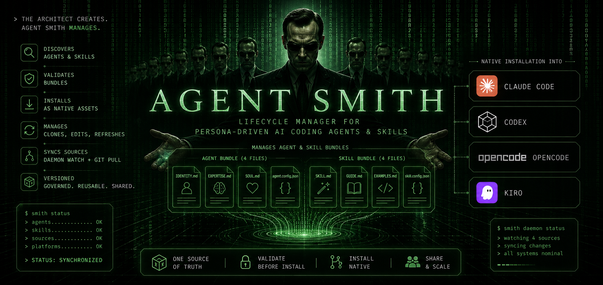
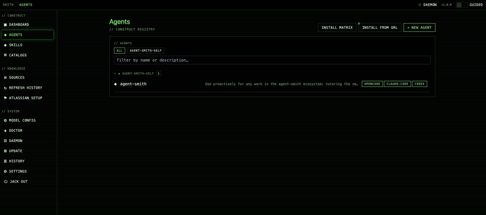
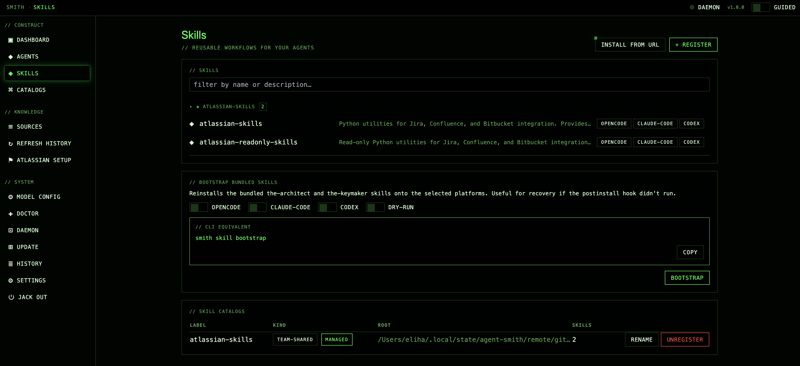

<p align="center">
  
</p>

<h1 align="center">Agent Smith</h1>

<p align="center">
  <strong>A lifecycle manager for AI coding agents.</strong><br/>
  Author once. Validate. Install into OpenCode, Claude Code, Codex, and Kiro.
</p>

<p align="center">
  <a href="#quick-start">Quick start</a> ·
  <a href="#what-you-can-build">Examples</a> ·
  <a href="#agents-vs-skills">Agents vs skills</a> ·
  <a href="#documentation">Docs</a> ·
  <a href="./CONTRIBUTING.md">Contributing</a>
</p>

---

## Why

AI coding tools are moving from a single general assistant to fleets of specialized agents. Each platform — OpenCode, Claude Code, Codex, Kiro — defines them differently: different files, frontmatter, permissions, tool names, and discovery rules. Useful agents become hard to share, audit, version, and keep consistent.

`agent-smith` treats an agent as a **source-controlled bundle**. Author once as four files. Validate against a strict schema. Install into every platform with one command.

Define a bundle:

- `IDENTITY.md` — who the agent is and when to use it
- `EXPERTISE.md` — what the agent knows, checks, and optimizes for
- `SOUL.md` — how the agent behaves, communicates, and makes tradeoffs
- `agent.config.json` — targets, model tier, mode, permissions, MCP servers, skills, knowledge sources (including URLs routed through declared MCP tools)

Then `smith agent install` emits the right native config for every platform you target.

A fifth target, `agents-md`, emits a single `AGENTS.md` — the cross-tool standard that Cursor, Windsurf, GitHub Copilot, Aider, Codex CLI, Devin, Junie, Roo, Zed, Warp, and Gemini CLI all read. Bundles whose materialized knowledge would overflow the inline budget auto-compile into a TOC stanza + on-demand fetch (smart default since v2.1; smith decides, you can override). One bundle reaches every AGENTS.md-aware runtime with progressive-disclosure pointers instead of inlined-and-truncated prose. See [guide/16 — Knowledge compiler](./guide/16-knowledge-compiler.md).

> "Me. Me. Me too." — Agent Smith

---

## Quick start

```bash
gh repo clone eliharoun/agent-smith ~/.agent-smith && bash ~/.agent-smith/bin/install
```

Requires bash (the installer itself is a bash script and offers to install [Bun](https://bun.sh) if it's missing). [`gh`](https://cli.github.com/) is a convenience for the clone above — you can substitute `git clone https://github.com/eliharoun/agent-smith ~/.agent-smith` if you prefer.

After install, open a new shell and verify:

```bash
smith doctor
```

Then launch the companion agent and tell it what you want to build:

```bash
opencode --agent agent-smith     # or: claude --agent agent-smith
```

> *"I want an agent that reviews TypeScript pull requests for type-safety issues."*

The companion agent walks you through eight focused questions (identity, expertise, voice, targets, model, mode, permissions, skills), then scaffolds, validates, and installs the bundle. Or skip the conversation:

```bash
smith agent init my-debugger --from incident-debugger
smith agent install my-debugger
```

For the full installer behavior, paths, and recovery commands, see [getting started](./guide/01-getting-started.md).

---

## What you can build

Four example bundles ship with the package. Install one in seconds with `--from`:

| Example | Mode | Permissions | Use it when... |
|---|---|---|---|
| `incident-debugger` | subagent | read + edit + bash | a production incident is in progress and you want a partner that gathers signal, isolates root cause, and prefers rollback to forward-fix |
| `security-threat-modeler` | primary | read-only | reviewing a new feature for STRIDE-style threats and producing a markdown threat model |
| `repo-cartographer` | subagent | read-only + lsp | exploring an unfamiliar codebase: locating implementations, tracing call graphs, mapping module structure |
| `knowledge-demo` | subagent | defaults | demonstrating knowledge sources end-to-end — inline budgeting and on-disk indexing |

```bash
smith agent init my-debugger --from incident-debugger
smith agent validate my-debugger
smith agent install my-debugger
```

Beyond the examples, anything you'd describe as a *role with operational boundaries* is a candidate: PR risk reviewers, AI-diff verifiers, support-ticket reproducers, release scribes, ADR stewards, migration surgeons. A general assistant can attempt any of these. A specialized agent does the same task repeatedly with the right persona, constraints, tools, and output format.

---

## Agents vs skills

Skills and agents are different abstractions, not competitors. Most production setups use both.

- A **skill** is reusable *know-how* — a checklist, workflow, script bundle, or reference pack that any agent can load on demand. Portable across tools (Claude Code, OpenCode, Codex, and Kiro all consume the open Agent Skills standard) and lightweight (loaded only when relevant).
- A **custom agent** is a reusable *worker identity* — a role with its own persona, model tier, tool access, permissions, and isolated context window. Agents define **who** does the work; skills define **how** it should be done.

A `pr-risk-reviewer` works best as an **agent**: it should run read-only, examine the diff in its own context window so it doesn't pollute your main thread, route to a stronger reasoning model, and return a single merge recommendation. The review *rubric* it follows — severity definitions, output format, company conventions — is best authored as a **skill** the agent loads. The agent enforces the constraint; the skill encodes the procedure.

`agent-smith` manages the **agent layer**: portable 4-file bundles, validated against a strict schema, with permissions/model tier/skills declared in `agent.config.json`, installed correctly into Claude Code, OpenCode, Codex, and Kiro. Skills you author separately (or import from a shared catalog) plug into bundles via the `skills` field.

---

## Browser GUI

If you'd rather click than type, `smith gui` launches a local browser interface that wraps every daily-workflow command — agent and skill management, knowledge sources, daemon control, doctor repair, update, jack-out, and persistent job history.

```bash
smith gui                       # default port 7777, auto-opens browser
```

<p align="center">
  
  <br/>
  <em>Agents: every registered bundle, per-platform install status, jump straight to the editor or installer.</em>
</p>

<p align="center">
  
  <br/>
  <em>Skills: drift status, install/update/uninstall, validate against the bundled schema.</em>
</p>

For the developer setup (Vite dev server, Storybook, e2e), see [`gui/README.md`](./gui/README.md).

---

## Common commands

```bash
smith agent init <name> --from <example>   # scaffold from a bundled example
smith agent validate                       # check every bundle against the schema
smith agent install <name>                 # render + install to its targets
smith agent install --from <git-url>       # install from a git repo
smith agent list                           # all known agents and their targets

smith skill list                           # installed skills + drift status
smith skill install <catalog>/<name>       # install a skill into all platforms

smith skill validate <name>                # validate a skill's frontmatter

smith config get [key]                     # show model resolution settings
smith agent reconfigure <name>             # grant/revoke refresh hooks for an agent
smith knowledge remove <agent> <source-id> # remove a knowledge source from a bundle

smith doctor                               # platform health, schema drift, registry hygiene
smith status                               # registry + paths
smith update                               # git pull + bun install + doctor
```

Full reference: [`smith --help`](./CHEATSHEET.md), the [cheat sheet](./CHEATSHEET.md), or the [CLI reference](./guide/14-cli-reference.md).

---

## Documentation

Start with the [in-depth guide](./GUIDE.md) — a hub that links into focused topic spokes under [`guide/`](./guide/).

**Getting started & authoring**
- [`01-getting-started.md`](./guide/01-getting-started.md) — install layout, the first three commands, your first agent
- [`02-bundle-anatomy.md`](./guide/02-bundle-anatomy.md) — what a bundle is, the four files, schema, validation, USER.md mechanics
- [`14-cli-reference.md`](./guide/14-cli-reference.md) — every command with every flag, exit codes, examples

**Installing, models, and platforms**
- [`03-installing-and-rendering.md`](./guide/03-installing-and-rendering.md) — what `smith agent install` does, per-platform output, idempotency
- [`06-permissions-and-platforms.md`](./guide/06-permissions-and-platforms.md) — capability mapping, presets, per-platform translator gaps, MCP servers
- [`07-models.md`](./guide/07-models.md) — model-tier resolution, per-platform behavior, curated fallbacks

**Sharing, skills, and knowledge**
- [`05-skills.md`](./guide/05-skills.md) — installing skills, `requires.skills`, skill catalogs, drift
- [`08-registries-and-catalogs.md`](./guide/08-registries-and-catalogs.md) — registries, catalog kinds, precedence
- [`04-knowledge.md`](./guide/04-knowledge.md) — per-agent knowledge sources (files, dirs, URLs, git, Confluence, Jira), routing URL fetches through MCP servers, declaring `mcp.required` / `mcp.peer` bundle dependencies
- [`16-knowledge-compiler.md`](./guide/16-knowledge-compiler.md) — v2 progressive disclosure: `compile` block, `agents-md` target, BM25 retrieval server, APM import
- [`15-sharing-and-distribution.md`](./guide/15-sharing-and-distribution.md) — end-to-end publisher + consumer flow

**Operating and troubleshooting**
- [`09-daemon.md`](./guide/09-daemon.md) — what the daemon watches, lifecycle commands, debugging
- [`10-doctor.md`](./guide/10-doctor.md) — health-check sections, exit codes, drift remediation
- [`11-update-and-uninstall.md`](./guide/11-update-and-uninstall.md) — `smith update`, `smith agent uninstall`, `smith jack-out`
- [`12-error-handling.md`](./guide/12-error-handling.md) — exit-code taxonomy, every `SmithError` variant
- [`13-paths-and-state.md`](./guide/13-paths-and-state.md) — complete filesystem layout

**Visual reference**
- [`ARCHITECTURE.md`](./ARCHITECTURE.md) — component map, data flow, install lifecycle, glossary
- [`CHEATSHEET.md`](./CHEATSHEET.md) — one-page command + paths + exit-code reference

---

## Contributing

Pull requests welcome. See [`CONTRIBUTING.md`](./CONTRIBUTING.md) for the tool-map / schema update workflow, local development setup, and release process.

```bash
bun install
bun test
bun run typecheck
```

To report a bug, [open an issue](https://github.com/eliharoun/agent-smith/issues). Security issues should be reported privately — see [`SECURITY.md`](./SECURITY.md).

By participating in this project you agree to abide by its [Code of Conduct](./CODE_OF_CONDUCT.md).

---

## License

MIT — see [`LICENSE`](./LICENSE).
